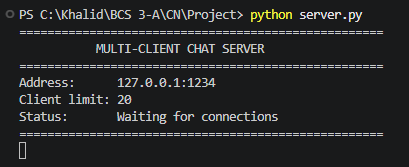
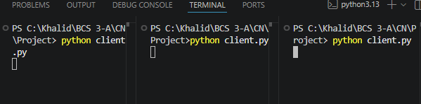
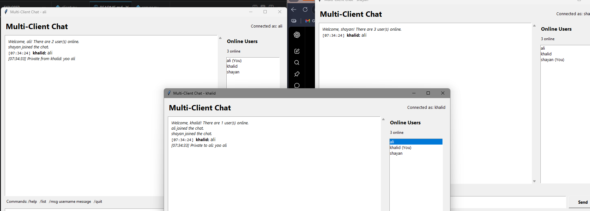

# 💬 Multi-Client Chat Application

A desktop-based **multi-client chat application** built using **Python**, **TCP sockets**, **multithreading**, and **Tkinter**. The application allows multiple users to connect to a central server, communicate in real time, send private messages, and view currently connected users through a graphical interface.

---

## 📌 Features

- ✅ Multi-client communication using TCP sockets
- ✅ Graphical User Interface (Tkinter)
- ✅ Public group chat
- ✅ Private messaging between users
- ✅ Live online users list
- ✅ Duplicate username protection
- ✅ Join and leave notifications
- ✅ Message timestamps
- ✅ Command-based interface
- ✅ Thread-safe server handling
- ✅ Graceful client disconnection

---

## 🖥️ Technologies Used

- Python 3
- Socket Programming (TCP)
- Multithreading
- Tkinter
- Client-Server Architecture

---

## 📂 Project Structure

```
multi-client-chat-python/
│
├── client.py
├── server.py
├── README.md
├── requirements.txt
├── .gitignore
└── screenshots/
```

---

## 🚀 How to Run

### 1. Clone the repository

```bash
git clone https://github.com/Stranger-Khalid/multi-client-chat-python.git
cd multi-client-chat-python
```

### 2. Start the server

```bash
python server.py
```

The server will begin listening on:

```
127.0.0.1:1234
```

### 3. Start one or more clients

Open another terminal (or multiple terminals):

```bash
python client.py
```

Enter a unique username for each client.

---

## 💻 Available Commands

| Command | Description |
|---------|-------------|
| `/help` | Display available commands |
| `/list` | View all connected users |
| `/msg <username> <message>` | Send a private message |
| `/quit` | Disconnect from the server |

---

## 📸 Screenshots




### Server Running


---

### Multiple Connected Clients



---

### Private Messaging



---

## 🏗️ System Architecture

```
                +------------------+
                |     Server       |
                |------------------|
                | Socket Listener  |
                | Client Manager   |
                | Message Routing  |
                +--------+---------+
                         |
        -------------------------------------
        |                 |                 |
+---------------+ +---------------+ +---------------+
|   Client 1    | |   Client 2    | |   Client 3    |
| Tkinter GUI   | | Tkinter GUI   | | Tkinter GUI   |
+---------------+ +---------------+ +---------------+
```

---

## ⚙️ How It Works

1. The server listens for incoming TCP connections.
2. Each client connects using a unique username.
3. The server creates a separate thread for every connected client.
4. Messages are broadcast to all connected users.
5. Private messages are routed directly to the selected recipient.
6. The online users list is synchronized automatically.
7. Clients can disconnect safely using the `/quit` command.

---

## 🎯 Skills Demonstrated

- Socket Programming
- TCP Communication
- Client-Server Architecture
- Multithreading
- GUI Development
- Event-Driven Programming
- Thread Synchronization
- Network Programming
- Command Parsing
- Software Design

---

## 🔮 Future Improvements

- User authentication
- Chat rooms
- File sharing
- Message history
- Database integration
- End-to-end encryption
- Emoji support
- Dark mode
- LAN auto-discovery
- Internet-based deployment

---

## 👨‍💻 Author

**Mohammad Khalid**

GitHub: https://github.com/Stranger-Khalid

---

## 📄 License

This project is developed for educational and learning purposes.